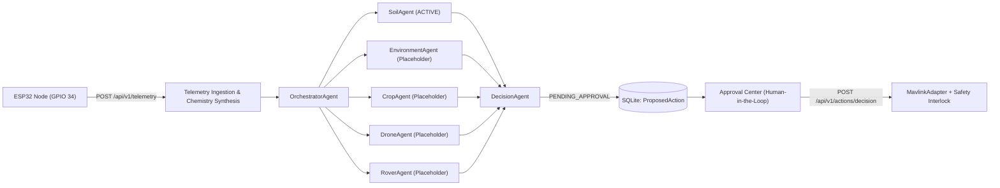

# AI FarmWise — Multi-Agent & LangGraph Integration Guide

This guide documents how to replace the Phase-1 placeholder agents (`EnvironmentAgent`, `CropAgent`, `DroneAgent`, `RoverAgent`) with full LangGraph / LLM-backed or sensor-fusion implementations without changing the FastAPI endpoints, database models, or React dashboard.

---

## 1. Architecture Overview

Every telemetry packet ingested at `POST /api/v1/telemetry` triggers the following pipeline:



---

## 2. Base Agent Contract

All specialist agents inherit from `BaseAgent` in `server/app/agents/base/agent_interface.py`:

```python
from app.agents.base.agent_context import AgentContext
from app.agents.base.agent_interface import BaseAgent
from app.agents.base.agent_result import AgentResult, ProposedActionDraft


class CustomAgent(BaseAgent):
    name = "custom_agent"
    description = "Describes what this specialist evaluates."
    implemented = True

    async def run(self, context: AgentContext) -> AgentResult:
        # Inspect context.soil_moisture, context.soil_ph, context.crop_bounds, etc.
        return AgentResult(
            agent_name=self.name,
            status="OK",
            summary="Human-readable evaluation summary",
            findings={"metric": 42},
            evidence=["Sensor X reading: 42"],
            missing_data=[],
            proposals=[
                ProposedActionDraft(
                    type="CUSTOM_DISPATCH",
                    title="Human-readable action title",
                    why="Causal explanation shown in Approval Center",
                    evidence=["Evidence item 1"],
                    missing_data=["Optional missing modality"],
                    target="zone_01",
                    confidence=0.90,
                    parameters={"zone": "zone_01"},
                )
            ],
        )
```

---

## 3. Plugging in a LangGraph StateGraph

To upgrade any placeholder agent (for example `CropAgent` in `server/app/agents/crop/crop_agent.py`) or `OrchestratorAgent` to **LangGraph**:

1. Install LangGraph:
   ```bash
   pip install langgraph langchain-core
   ```
2. Build a compiled graph inside the agent module and invoke it inside `async def run(self, context: AgentContext) -> AgentResult`:
   ```python
   from typing import TypedDict
   from langgraph.graph import StateGraph, END
   from app.agents.base import AgentContext, AgentResult, BaseAgent

   class CropGraphState(TypedDict):
       context: AgentContext
       npk_deficit: bool
       explanation: str

   def analyze_npk(state: CropGraphState) -> CropGraphState:
       ctx = state["context"]
       deficit = ctx.nitrogen < 28.0
       return {
           **state,
           "npk_deficit": deficit,
           "explanation": f"Nitrogen at {ctx.nitrogen} mg/kg",
       }

   builder = StateGraph(CropGraphState)
   builder.add_node("analyze_npk", analyze_npk)
   builder.set_entry_point("analyze_npk")
   builder.add_edge("analyze_npk", END)
   CROP_GRAPH = builder.compile()

   class CropAgent(BaseAgent):
       name = "crop_agent"
       implemented = True

       async def run(self, context: AgentContext) -> AgentResult:
           final_state = await CROP_GRAPH.ainvoke({
               "context": context,
               "npk_deficit": False,
               "explanation": "",
           })
           return AgentResult(
               agent_name=self.name,
               status="OK",
               summary=final_state["explanation"],
           )
   ```

---

## 4. Safety & Human-in-the-Loop Invariants

1. **No Direct Actuation from Agents**: Specialist agents must **never** call `mavlink_adapter` or `rover_adapter` directly. They only emit `ProposedActionDraft` objects.
2. **Single Pending Action Deduplication**: `DecisionAgent` automatically prevents duplicate `PENDING_APPROVAL` actions of the same `type` for the same farm.
3. **Emergency Stop Interlock**: Even after human approval, `POST /api/v1/actions/decision` verifies `farm.emergency_stop == False` before dispatching via `MavlinkAdapter`.
